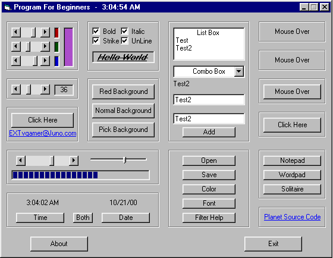

## Everything Beginner

### Description

This code does everything I could think of that a beginner would want to know. This code is very useful and helpful. Please vote if it helps.

EVERY ONE OF THESE HAS COMMENTS IN THE CODE

(except the really easy ones)

Shows you how to (with commects):

1) Let the user pick a RGB color and display it.

2) Show the value of a scroll bar in a label.

3) Put the selected item from a listbox in a label.

4) change a progress bar with a scrollbar and slider.

5) push a button to show the Time.

6) push a button to show the Date.

7) push a button to show the Time and Date.

8) Make a clock that updates every second.

9) Use a Checkbox to Make the text in a label bold.

10) Use a Checkbox to Make the text in a label Italic.

11) Use a Checkbox to Make the text in a label StrikeThru.

12) Use a Checkbox to Make the text in a label Underlined.

13) Change the form background to Red with a button.

14) Change the form background to a RGB color from scrollbars.

15) Change the form background to the color the user picks.

16) Enter text in a textbox and add it to a listbox.

17) Enter text in a textbox and add it to a combobox.

18) Enter text in a textbox and add it to a label.

19) Enter text in a textbox and add it to a textbox.

20) Push a button to show the common dialog Open.

21) Push a button to show the common dialog Save.

22) Push a button to show the common dialog Color.

23) Push a button to show the common dialog Font.

24) Has Comments to show you how to use common dialog filter.

25) Mouse over a label and change the mousepointer.

26) Mouse Over a label and change the forecolor.

27) Mouse over a button and change the caption.

28) Click a button to show a message box.

29) Click a button to open notepad.

29) Click a button to open wordpad.

29) Click a button to open solitaire.

30) Open the default web browser.

31) Open the default e-mail program.

40) Use a Yes and No button MsgBox
 
### More Info
 

             |
---                |---
**Submitted On**   |2000-10-21 03:17:34
**By**             |[Philip Beam](https://github.com/Planet-Source-Code/PSCIndex/blob/master/ByAuthor/philip-beam.md)
**Level**          |Beginner
**User Rating**    |4.7 (126 globes from 27 users)
**Compatibility**  |VB 5\.0, VB 6\.0
**Category**       |[Coding Standards](https://github.com/Planet-Source-Code/PSCIndex/blob/master/ByCategory/coding-standards__1-43.md)
**World**          |[Visual Basic](https://github.com/Planet-Source-Code/PSCIndex/blob/master/ByWorld/visual-basic.md)
**Archive File**   |[CODE\_UPLOAD1082710212000\.zip](https://github.com/Planet-Source-Code/philip-beam-everything-beginner__1-12192/archive/master.zip)

